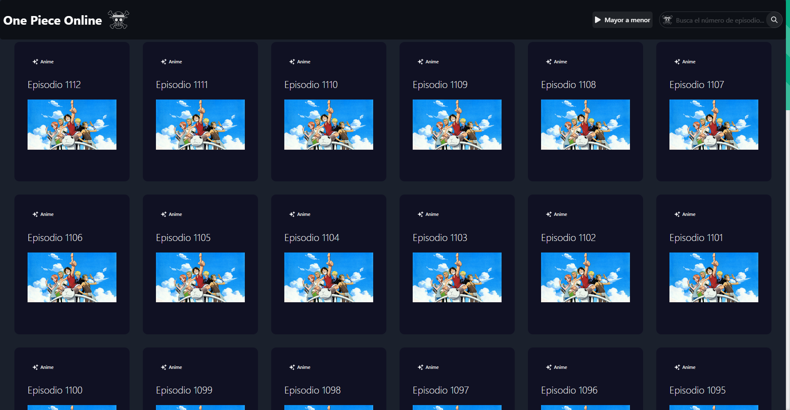
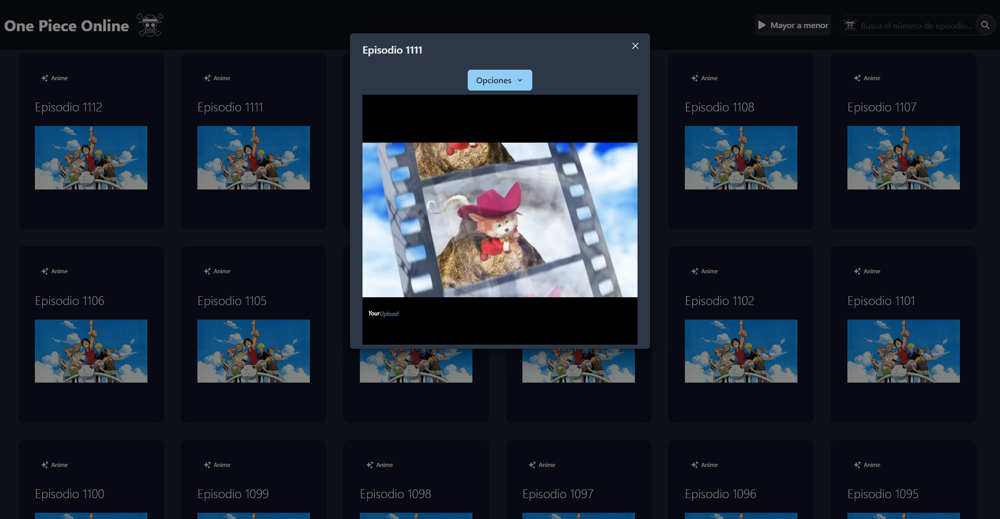

# 🍖🏴‍☠️ One Piece Online

[Español](readme.md)  / [Inglés](readme_en.md) 

## 📖 Sobre el proyecto

Este proyecto es un **Web Scraping** a los servicios de *AnimeFLV* para obtener todos los capitulos de One Piece y posteriormente su etiqueta IFrame dependiendo el reproductor que se seleccione.

## 🧠 Algoritmo

- Lista todos los capitulos tomando el más reciente desde la pagina de AnimeFLV.
- Los capitulos que no llega a obtener en el primer scraping (Debido a que la web los genera a medida que se scrollea) los genera en la respuesta JSON manualmente el controlador `getepisodecontroller.js` siguiendo la logica de los anteriores.
- Cuando se selecciona un controlador se ingresa al link del mismo y se obtiene el IFrame principal.
- En caso de que el reproductor principal no funcione, se pueden obtener los demás mediante Scraping a las etiquetas de opciones para así obtener el IFrame según la opción seleccionada.
- Se implementaron botones de busqueda, paginación y ordenamiento para mayor organización de los capitulos. También esto evita que se sobrecargue la pagina.

## 💻 Tecnologías usadas

Backend:
- **Framework:** Node.js
- **Scraping:** Puppeter
- **Gestor de paquetes:** NPM

Frontend:
- **Librería:** React
- **Componentes UI:** ChakraUI
- **Gestor de paquetes:** NPM

## 🚀 ¿Cómo deployarlo?

### Clonar el repositorio

1. Clona el repositorio desde GitHub: `git clone https://github.com/DarioAlbor/OnePieceOnline.git`
2. Navega al directorio del proyecto: `cd OnePieceOnline`

### Configurar y arrancar el servidor

1. Navega al directorio del servidor: `cd backend`
2. Instala las dependencias: `npm install`
4. Inicia el servidor: `npm start`

### Configurar y arrancar el cliente

1. Navega al directorio del cliente: `cd frontend`
2. Instala las dependencias: `npm install`
3. Navega entre los archivos `./pages/index.jsx`, `./components/episodemodal.jsx` y modifica la url por la de tu backend.
4. Inicia el cliente: `npm start`

¡Disfruta!

## ✨ Deployado utilizando

Frontend: [Vercel](https://vercel.com)
Backend: [Render](https://render.com)

## 📬 Contacto

Puedes contactarme mediante mi [portafolio](https://darioalbor.dev.ar).

También puedes contribuir al proyecto sumando nuevas ideas o líneas de código. ¡Toda ayuda es bienvenida!

## 📸 Imágenes

|  |  |
|:------------------------------------------:|:----------------------------------------------------:|
| Inicio                         | Selección de episodio                                |

|         |                  |
|:------------------------------------------:|:----------------------------------------------------:|
| Vista previa episodio                                    |                                            |
